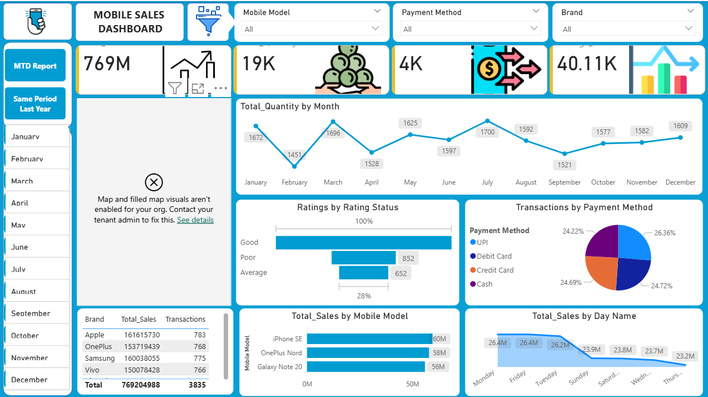
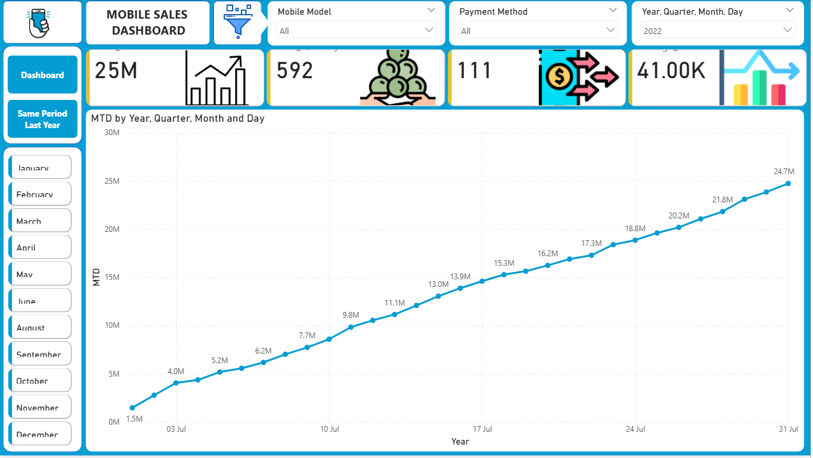
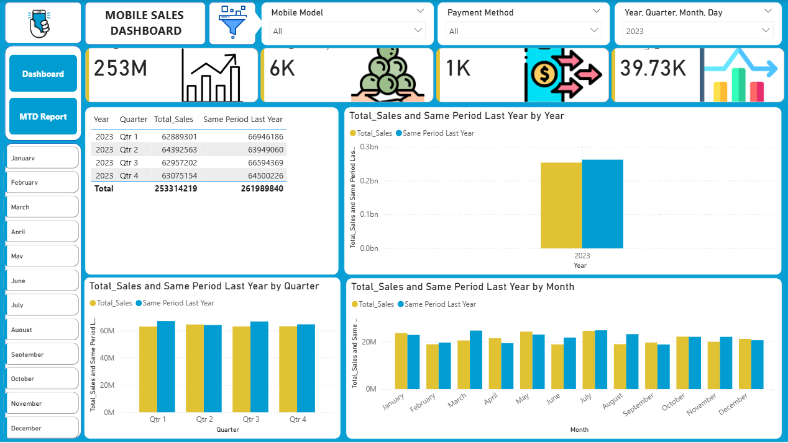

# Mobile Sales Dashboard

## Project Overview
An interactive Power BI dashboard designed to track sales performance across different mobile brands, models, and payment methods.

### Key Features
* **MTD Report:** Cumulative sales tracking throughout the month.
* **YoY Comparison:** Comparing current sales against the same period last year.
* **Segment Analysis:** Breakdown by Brand (Apple, Samsung, etc.) and Payment Method (UPI, Cash, Cards).

## Dashboard Preview

### Month-to-Date Analysis

### Year-over-Year Performance

## Tools Used
* Power BI Desktop
* DAX (Data Analysis Expressions)
* Power Query (ETL)
